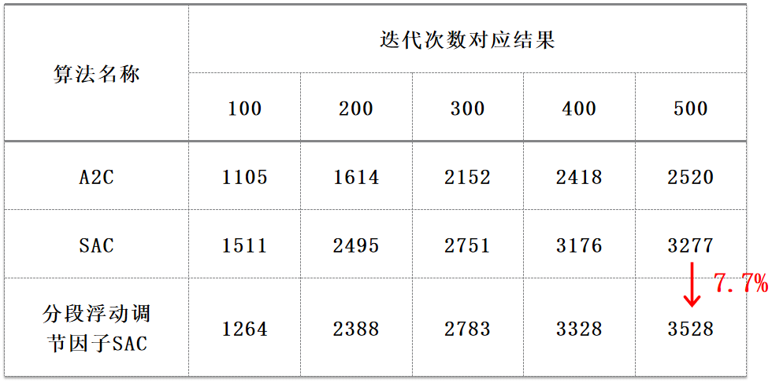
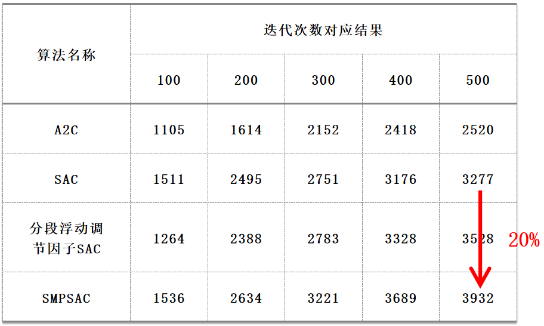

# CS294-112-homework + SAC 改进算法

改进部分原理详见硕士毕业论文（第三、四章）： [基于强化学习的足式机器人控制方法研究](https://github.com/taoyafan/Master_Graduation_Project/blob/master/%E5%9F%BA%E4%BA%8E%E5%BC%BA%E5%8C%96%E5%AD%A6%E4%B9%A0%E7%9A%84%E8%B6%B3%E5%BC%8F%E6%9C%BA%E5%99%A8%E4%BA%BA%E6%8E%A7%E5%88%B6%E6%96%B9%E6%B3%95%E7%A0%94%E7%A9%B6.pdf)

改进部分源码为：[hw5/sac/](hw5/sac/)

## 分段浮动调节因子 SAC
采用分段浮动调节因子代替原有的固定调节因子，在训练过程中动态的调整目标函数中策略熵的比重，仿真结果表明，性能相比原始SAC算法提高了7.7%。

## SMPSAC 算法。
先利用模型预测控制（Model predictive control，MPC）优化SAC算法（改进后）输出的动作，得到中间算法MPSAC，再采用策略熵改进MPC的目标函数，弱化MPSAC中的模型误差带来的负面效果，得到最终算法S(Soft)MPSAC，仿真结果表明，算法SMPSAC相对原始SAC性能提升了20%

